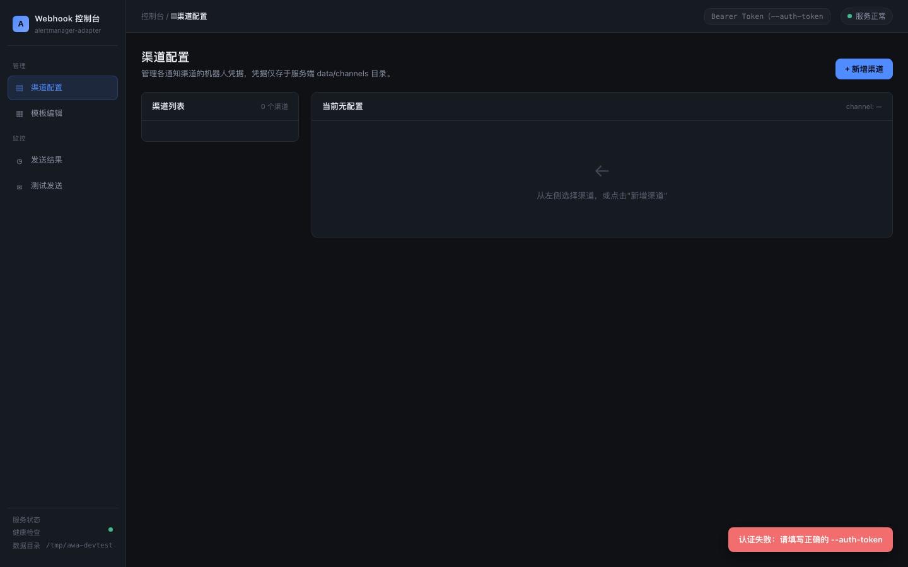
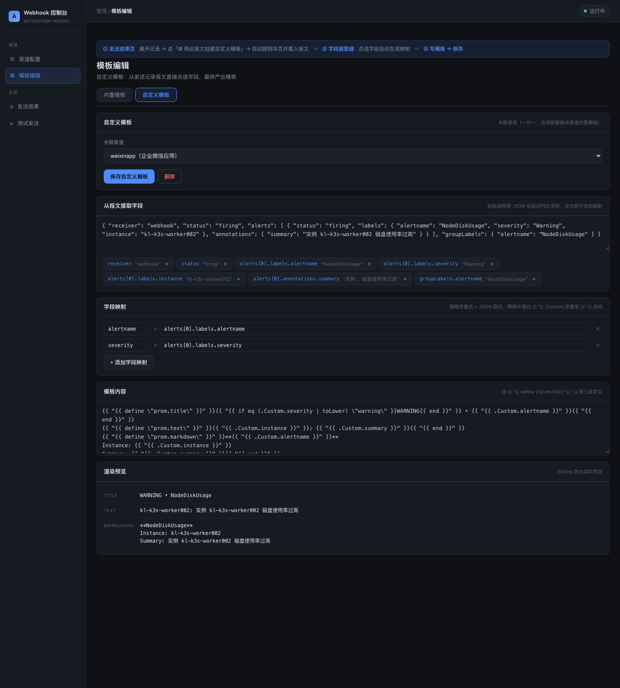

# alertmanager-webhook-adapter

> 通用告警通知网关：接收 [Prometheus AlertManager](https://prometheus.io/docs/alerting/latest/configuration/#webhook_config) 的 webhook 通知，通过多渠道推送，并提供**可视化运维控制台**（渠道管理 / 模板所见即所得 / 发送记录溯源 / 测试发送）。

---

## ✨ 功能特性

- **多渠道推送**：企业微信群机器人、钉钉（支持加签）、飞书、企业微信应用
- **可视化控制台**：深色运维 UI（`go:embed` 内嵌），渠道凭据 CRUD、模板所见即所得编辑、发送记录查询、测试发送
- **自定义模板 + 字段映射**：适配任意调用源 JSON 格式——声明「模板变量名 = JSON 路径」，模板内 `{{ .Custom.xxx }}` 访问
- **字段提取器**：从发送记录原始报文**一键点选字段**生成映射，模板生产零门槛
- **内容溯源**：发送记录保存原始调用体（raw）+ 渲染结果（title/text/markdown），成功/失败均入库
- **SQLite 默认存储**：单文件、纯 Go 驱动（`modernc.org/sqlite`，无 CGO，保持交叉编译）
- **生产加固**：Bearer 认证、结构化日志、发送重试（指数退避）、errcode 校验、请求体限制

---

## 🚀 快速开始

```bash
# 构建
$ cd cmd/alertmanager-webhook-adapter && go build -v -x

# 启动（默认 SQLite 存储 + Web UI 开启）
$ ./alertmanager-webhook-adapter --data-dir=/data --auth-token=your-token

# 查看帮助
$ ./alertmanager-webhook-adapter -h
```

启动后访问 `http(s)://{addr}/ui/`，在顶栏输入 `--auth-token` 配置的 Bearer Token 即可使用（所有 `/api/*` 接口均需认证）。

---

## 🖥️ Web UI 控制台



| 页面 | 功能 |
|------|------|
| **渠道配置** | 凭据 CRUD（含钉钉加签密钥），凭据仅存服务端，不出现于 URL / 日志 |
| **模板编辑** | 内置模板（实时预览）+ 自定义模板（字段映射 + 字段提取器）双标签页 |
| **发送结果** | 记录持久化查询（渠道/状态筛选、分页、详情含 raw 溯源） |
| **测试发送** | 向已配置渠道发测试消息，可关联模板 |

### 自定义模板（字段映射）



为适配**任意调用源**的 JSON 格式（Grafana、自研系统等），可为一个渠道配置自定义模板（一对一，启用即替换内置模板）：

1. **选渠道**：一个渠道最多一个自定义模板
2. **声明字段映射**：`模板变量名 = JSON 路径`，如 `severity = alerts[0].labels.severity`
3. **编写模板**：三段定义（`prom.title` / `prom.text` / `prom.markdown`），用 `{{ .Custom.xxx }}` 访问映射字段
4. **预览保存**：粘贴调用源 body 实时预览渲染结果，保存后该渠道发送即走此模板

**字段提取器**：创建模板时，可直接从**发送记录里的原始报文**选择一条，报文自动解析出全部字段路径，点击字段即自动生成映射（变量名自动命名去重）——无需手写 JSON 路径，最快产出模板。

路径语法与内置模板一致：`a.b.c` 点分 + `a[0].b` 数组下标；缺失字段返回空（模板用 `{{ if .Custom.x }}` 容错）。

---

## 📤 调用方式

> **调用方式（v2+）**：渠道凭据不再放在 URL 中，改为在 Web UI 渠道配置页管理，调用时只指定渠道名：

```
POST http(s)://{this-webhook-server-addr}/webhook/send/{channel}
```

示例：`POST /webhook/send/feishu`、`POST /webhook/send/dingtalk`。
旧版 `?channel_type=...&token=...` 调用方式已不再兼容。

**支持渠道与配置字段**（在 Web UI 渠道配置页填写，存于 SQLite）：

| 渠道 | 配置字段 |
|------|---------|
| `weixin` | `token`、`msg_type` |
| `dingtalk` | `token`、`secret`（可选，机器人加签密钥）、`msg_type` |
| `feishu` | `token`、`msg_type` |
| `weixinapp` | `corp_id`、`agent_id`、`agent_secret`、`to_user`、`to_party`、`to_tag`、`msg_type` |

> **钉钉机器人加签**：若钉钉机器人安全设置开启「加签」，在渠道配置页填入 `secret`（`SEC` 开头），发送时自动在 URL 追加 `timestamp` 与 `sign` 参数（HMAC-SHA256，key=secret，data=`timestamp\nsecret`）。

### 配置 Alertmanager

```yaml
- name: 'sre-team'
  webhook_configs:
  # 渠道凭据在 Web UI 渠道配置页管理，URL 只留渠道名；认证走 http_config.authorization
  - url: "http://10.0.0.1:8090/webhook/send/weixin"
    http_config:
      authorization:
        type: Bearer
        credentials: "your-auth-token"   # 与 --auth-token 一致；未配置 --auth-token 时可不带
```

各渠道示例：`/webhook/send/weixin`、`/webhook/send/dingtalk`、`/webhook/send/feishu`、`/webhook/send/weixinapp`。

---

## 💾 存储

默认使用 **SQLite 单文件存储**（`modernc.org/sqlite` 纯 Go 驱动，无 CGO 依赖，保持交叉编译能力）：

- 数据库文件：`<data-dir>/adapter.db`（可用 `--sqlite-path` 指定其他路径）
- 三张表：`channels`（渠道凭据）、`templates`（模板内容）、`sends`（发送记录）
- 发送记录含内容快照：**原始调用体（raw）+ 渲染后的 title/text/markdown**，成功/失败均记录
- 发送记录上限 1000 条（超出自动裁剪最旧记录）

```bash
# 默认：SQLite 存储（adapter.db 位于 data-dir）
$ ./alertmanager-webhook-adapter --data-dir=/data --auth-token=your-token

# 指定 SQLite 文件路径
$ ./alertmanager-webhook-adapter --sqlite-path=/var/lib/awa/adapter.db

# 调试开关：改用旧的 JSON 数据目录存储（channels/*.json + sends.json + templates/*.tmpl）
$ ./alertmanager-webhook-adapter --use-data-dir --data-dir=/tmp/debug
```

> `--use-data-dir` 仅用于临时调试，两种存储模式互斥、数据不互通（不会迁移旧 JSON 数据）。生产环境使用默认 SQLite。

---

## ⚙️ 部署

### systemd 服务

```bash
# 安装二进制到 /usr/local/bin/alertmanager-webhook-adapter 并 chmod +x
$ cp deploy/alertmanager-webhook-adapter.service /etc/systemd/system/

# 确保 service 文件内 ExecStart= 路径一致
$ vim /etc/systemd/system/alertmanager-webhook-adapter.service

$ systemctl daemon-reload
$ systemctl start alertmanager-webhook-adapter
```

> systemd 单元默认使用数据目录 `/var/lib/alertmanager-webhook-adapter`，认证 token 通过环境变量 `AUTH_TOKEN` 注入（见 service 文件内注释），生产环境建议使用 `EnvironmentFile` 管理密钥。

### Kubernetes

```bash
cd deploy/k8s
kubectl apply -f deployment.yaml   # 含 PVC（awh-data 1Gi）、liveness/readiness 探针（/healthz /readyz）、--auth-token（来自 Secret awh-auth-token，optional）
kubectl apply -f service.yaml
```

> 清单中 `--auth-token` 通过 Secret `awh-auth-token` 注入（`optional: true`，未创建 Secret 时认证关闭）。
> 生产环境建议先创建 Secret：`kubectl create secret generic awh-auth-token --from-literal=token=<你的token>`。

### Helm（本地 Chart，不依赖远程 repo）

```bash
cd deploy/charts/alertmanager-webhook-adapter
vim values.yaml   # 按需修改镜像/数据目录/认证等

helm upgrade alertmanager-webhook-adapter \
  . \
  --install \
  --namespace infra \
  --values values.yaml
```

---

## 🧰 命令行参数

```
$ ./alertmanager-webhook-adapter -h
alertmanager-webhook-adapter

Usage:
  alertmanager-webhook-adapter [flags]

Flags:
  -h, --help                    help for alertmanager-webhook-adapter
  -l, --listen-address string   the address to listen (default "0.0.0.0:8090")
  -s, --signature string        the signature (default "未知")
  -n, --tmpl-default string     the default tmpl name
  -d, --tmpl-dir string         the tmpl dir
      --tmpl-lang string        the language for template filename
  -t, --tmpl-name string        the tmpl name
      --data-dir string         data directory for channel configs, templates and send records (default "/data")
      --sqlite-path string      path to SQLite database file (default: <data-dir>/adapter.db)
      --use-data-dir            use legacy JSON data-dir storage instead of SQLite (debug only)
      --web-enabled             enable web UI and management API (default true)
      --auth-token string       shared bearer token for request authentication (empty = disabled)
      --log-level string        log level: debug/info/warn/error (default "info")
      --log-format string       log format: text/json (default "text")
```

---

## 📝 自定义模板文件（高级）

项目为所有渠道内置了模板，也可用 `--tmpl-dir` 等参数加载自定义模板文件覆盖默认值：

- `--tmpl-dir (-d)`：模板目录（**必填**才能加载自定义模板）
- `--tmpl-name (-t)`：为所有渠道使用同一个模板文件
- `--tmpl-default (-n)`：为未匹配渠道使用默认模板文件

> 若 `--tmpl-name` 与 `--tmpl-default` 同时指定，`--tmpl-default` 被忽略。

模板文件以 [`AlertmanagerWebhookMessage`](./pkg/models/alert.go) 对象作为输入数据，**必须定义**以下三段：

- `prom.title`
- `prom.text`
- `prom.markdown`

`--tmpl-lang <lang>` 可改变加载规则（加载 `<channel>.<lang>.tmpl` 等命名文件）；内置 `en`/`zh` 两种语言，默认 `en`。

### AlertInstance 如何确定？

默认模板按优先级从 alerts 标签中寻找告警实例：`alertinstance` → `instance` → `node` → `nodename` → `host` → `hostname` → `ip`。

推荐在告警规则中直接添加 `alertinstance` 标签（`label_join` 或直接写死），示例：

```yaml
- alert: KubePodCrashLooping
  expr: max_over_time(kube_pod_container_status_waiting_reason{reason="CrashLoopBackOff", job="kube-state-metrics", namespace=~".*"}[5m]) >= 1
  for: 15m
  labels:
    severity: warning
    alertinstance: '{{ $labels.namespace }}/{{ $labels.pod }}'
  annotations:
    description: 'Pod {{ $labels.namespace }}/{{ $labels.pod }} ({{ $labels.container }}) is in waiting state (reason: "CrashLoopBackOff").'
    summary: Pod is crash looping.
```

---

## 📄 文档

- [Chinese Screenshots](./docs/screenshot-zh.md)（历史版本界面截图）
