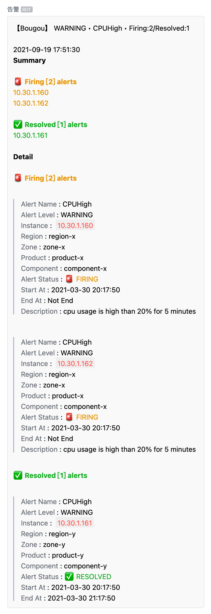
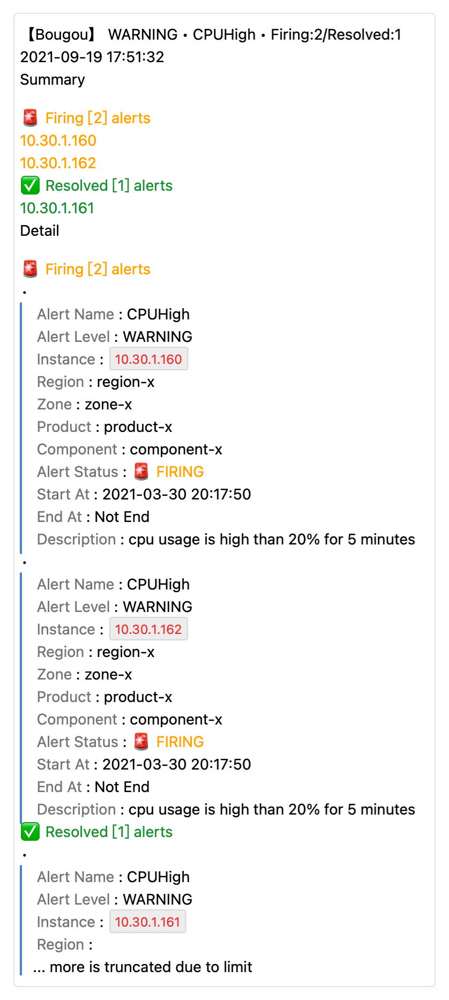
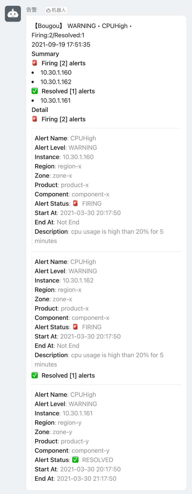
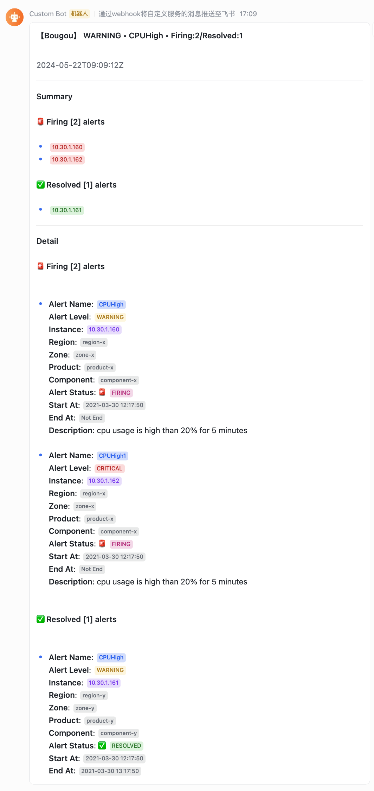

# alertmanager-webhook-adapter

A general webhook server for receiving [Prometheus AlertManager](https://prometheus.io/docs/alerting/latest/configuration/#webhook_config)'s notifications and send them through different channel types.


## Supported Notification Channels

> **调用方式（v2+）**：渠道凭据不再放在 URL 中，改为在 Web UI（`/ui/`）渠道配置页管理，调用时只指定渠道名：
>
> ```
> POST http(s)://{this-webhook-server-addr}/webhook/send/{channel}
> ```
>
> 示例：`POST /webhook/send/feishu`、`POST /webhook/send/dingtalk`。
> 旧版 `?channel_type=...&token=...` 调用方式已不再兼容。

支持的渠道：

- `weixin`, Weixin Group Bot / 企业微信群机器人
- `dingtalk`, Dingtalk Group Bot / 钉钉群机器人
- `feishu`, Feishu Group Bot / 飞书群机器人
- `weixinapp`, Weixin Application / 企业微信应用

各渠道配置字段（在 Web UI 渠道配置页填写，默认存于 SQLite 数据库，见「存储」章节）：

| 渠道 | 配置字段 |
|------|---------|
| `weixin` | `token`、`msg_type` |
| `dingtalk` | `token`、`secret`（可选，机器人加签密钥）、`msg_type` |
| `feishu` | `token`、`msg_type` |
| `weixinapp` | `corp_id`、`agent_id`、`agent_secret`、`to_user`、`to_party`、`to_tag`、`msg_type` |

> **钉钉机器人加签**：若钉钉机器人安全设置开启「加签」，在渠道配置页填入 `secret`（`SEC` 开头），
> 发送时自动在 URL 追加 `timestamp` 与 `sign` 参数（HMAC-SHA256，key=secret，data=`timestamp\nsecret`）。

## Web UI 控制台

内置深色运维控制台（纯静态，`go:embed` 嵌入），提供：

- **渠道配置**：凭据 CRUD（含钉钉加签密钥），凭据仅存于服务端，不再出现在 URL / 日志
- **模板编辑**：所见即所得，编辑时实时预览渲染结果（300ms 防抖）
- **发送结果**：发送记录持久化查询（按渠道/状态筛选、分页、详情；测试发送带「测试」标识并记录真实渠道）
- **测试发送**：向已配置渠道发测试消息验证配置；**可关联模板**，模板渠道与发送渠道约束，模板字段以表单填写（含自定义标签 KV）

启动后访问 `http(s)://{addr}/ui/`，在顶栏输入 `--auth-token` 配置的 Bearer Token 即可使用（所有 `/api/*` 接口均需认证）。

```bash
# 示例：启用 Web UI（默认开启），数据目录 /data
$ ./alertmanager-webhook-adapter --data-dir=/data --auth-token=your-token

# 关闭 Web UI
$ ./alertmanager-webhook-adapter --web-enabled=false
```

## 存储

默认使用 **SQLite 单文件存储**（`modernc.org/sqlite` 纯 Go 驱动，无 CGO 依赖，保持交叉编译能力）：

- 数据库文件：`<data-dir>/adapter.db`（可用 `--sqlite-path` 指定其他路径）
- 三张表：`channels`（渠道凭据）、`templates`（模板内容）、`sends`（发送记录）
- 发送记录含内容快照：**原始调用体（raw）+ 渲染后的 title/text/markdown**，成功/失败均记录，便于溯源与模板调试
- 发送记录上限 1000 条（超出自动裁剪最旧记录）

```bash
# 默认：SQLite 存储（adapter.db 位于 data-dir）
$ ./alertmanager-webhook-adapter --data-dir=/data --auth-token=your-token

# 指定 SQLite 文件路径
$ ./alertmanager-webhook-adapter --sqlite-path=/var/lib/awa/adapter.db

# 调试开关：改用旧的 JSON 数据目录存储（channels/*.json + sends.json + templates/*.tmpl）
$ ./alertmanager-webhook-adapter --use-data-dir --data-dir=/tmp/debug
```

> `--use-data-dir` 仅用于临时调试，两种存储模式互斥、数据不互通（不会迁移旧 JSON 数据）。生产环境使用默认 SQLite。

## Run

### Build and Run

```bash
$ cd cmd/alertmanager-webhook-adapter
$ go build -v -x

$ ./alertmanager-webhook-adapter

# see help
$ ./alertmanager-webhook-adapter -h

# Add signature for sent messages
$ ./alertmanager-webhook-adapter --listen-address=:8060 --signature "Anything-You-Like"
# the signature will be added to the beginning of the message:
# 【Anything-You-Like】this-is-the-xxxxxxxxxx-message
```

### Start as systemd service

```bash
# Install the binary alertmanager-webhook-adapter file to some directory
# like /usr/local/bin/alertmanager-webhook-adapter
# and chmod +x /usr/local/bin/alertmanager-webhook-adapter

$ cp deploy/alertmanager-webhook-adapter.service /etc/systemd/system/

# make sure the bin path to be consistent
# ExecStart=
$ vim /etc/systemd/system/alertmanager-webhook-adapter.service

$ systemctl daemon-reload
$ systemctl start
```

> systemd 单元默认使用数据目录 `/var/lib/alertmanager-webhook-adapter`，
> 认证 token 通过环境变量 `AUTH_TOKEN` 注入（见 service 文件内注释），
> 生产环境建议使用 `EnvironmentFile` 管理密钥。

### Run in K8S

Apply manifests:

```bash
cd deploy/k8s
kubectl apply -f deployment.yaml   # 含 PVC（awh-data 1Gi）、liveness/readiness 探针（/healthz /readyz）、--auth-token（来自 Secret awh-auth-token，optional）
kubectl apply -f service.yaml
```

> 清单中 `--auth-token` 通过 Secret `awh-auth-token` 注入（`optional: true`，未创建 Secret 时认证关闭）。
> 生产环境建议先创建 Secret：`kubectl create secret generic awh-auth-token --from-literal=token=<你的token>`。

Or Deploy with Helm (本地 Chart，不依赖远程 repo)

```bash
# 使用仓库自带的本地 chart
cd deploy/charts/alertmanager-webhook-adapter
vim values.yaml   # 按需修改镜像/数据目录/认证等

helm upgrade alertmanager-webhook-adapter \
  . \
  --install \
  --namespace infra \
  --values values.yaml
```

## Configure Alertmanager to send alert messages to this webhook server

```yaml
- name: 'sre-team'
  webhook_configs:
  # 渠道凭据在 Web UI 渠道配置页管理，URL 只留渠道名；认证走 http_config.authorization
  - url: "http://10.0.0.1:8090/webhook/send/weixin"
    http_config:
      authorization:
        type: Bearer
        credentials: "your-auth-token"   # 与 --auth-token 一致；未配置 --auth-token 时可不带
```

> 各渠道示例：`/webhook/send/weixin`、`/webhook/send/dingtalk`、`/webhook/send/feishu`、
> `/webhook/send/weixinapp`。

## Command

```
$ ./alertmanager-webhook-adapter -h
alertmanager-webhook-adapter

Usage:
  alertmanager-webhook-adapter [flags]

Flags:
  -h, --help                    help for alertmanager-webhook-adapter
  -l, --listen-address string   the address to listen (default "0.0.0.0:8090")
  -s, --signature string        the signature (default "未知")
  -n, --tmpl-default string     the default tmpl name
  -d, --tmpl-dir string         the tmpl dir
      --tmpl-lang string        the language for template filename
  -t, --tmpl-name string        the tmpl name
      --data-dir string         data directory for channel configs, templates and send records (default "/data")
      --sqlite-path string      path to SQLite database file (default: <data-dir>/adapter.db)
      --use-data-dir            use legacy JSON data-dir storage instead of SQLite (debug only)
      --web-enabled             enable web UI and management API (default true)
      --auth-token string       shared bearer token for request authentication (empty = disabled)
      --log-level string        log level: debug/info/warn/error (default "info")
      --log-format string       log format: text/json (default "text")
```

## Builtin Templates Notification Screenshots

- [Chinese](./docs/screenshot-zh.md)

| WeixinGroupBot                                | WeixinApp                                        | DingTalkGroupBot                                | FeishuGroupBot                                |
| --------------------------------------------- | ------------------------------------------------ | ----------------------------------------------- | --------------------------------------------- |
|  |  |  |  |

## Custom Templates

The project already has builtin templates for all supported notification channels.
But you can use your own template file(s) to override those defaults.

You can use the following three options.

-  `--tmpl-dir (-d)`
-  `--tmpl-name (-t)`
-  `--tmpl-default (-n)`

The `--tmpl-dir` is a MUST if you want to load your custom templates. `--tmpl-name` and `--tmpl-default` is optional. So, there are THREE use cases when combining those options.

1. `--tmpl-dir <somepath>`
2. `--tmpl-dir <somepath> --tmpl-name <tmplname>`
3. `--tmpl-dir <somepath> --tmpl-default <tmplname>`

> If `--tmpl-name` and `--tmpl-default` are both specified, `--tmpl-default` will be ignored.

These three use cases are used for different purposes.

### `--tmpl-dir`

> **Purpose**: Use different template files for different channels

First, create a dir to store your template files, like `templates`. And then put your template files under the template dir.

The program will **try to search `<channel>.tmpl` files** under the tmpl dir for all supported channels,
and use the founded file as the template for the corresponding channel. If not found, use builtin template.

```bash
$ touch templates/feishu.tmpl
$ touch templates/weixin.tmpl

# use templates/feishu.tmpl for feishu channel
# use templates/weixin.tmpl for weixin channel,
# use builtin templates for other channels.
$ ./alertmanager-webhook-adapter -s Bougou --tmpl-dir ./templates/
```

### `--tmpl-dir` and `--tmpl-name`

> **Purpose**: Use one custom template for all channels.

Create your own template file, like `custom.tmpl`, and put it under the template dir.
The filename with suffix removed will be the template name and be used as value of the `--tmpl-name` parameter.

The program will **try to search `<tmplName>.tmpl` file** under the tmpl dir.
The selected tmpl file will be used for all notification channels. If not found, error and exit.

```bash
# use templates/custom.tmpl for all channels.
$ ./alertmanager-webhook-adapter -s Bougou --tmpl-dir ./templates/ --tmpl-name custom
```

### `--tmpl-dir` and `--tmpl-default`

> **Purpose**: Use different template files for only several channels, and use an extra template file for all other channels.

```bash
$ touch templates/feishu.tmpl
$ touch templates/weixin.tmpl

$ touch templates/default.tmpl

# use templates/feishu.tmpl for feishu channel
# use templates/weixin.tmpl for weixin channel,
# use templates/default.tmpl for other channels.
$ ./alertmanager-webhook-adapter -s Bougou --tmpl-dir ./templates/ --tmpl-default default
```

### Template Content

The template file should use an [`AlertmanagerWebhookMessage`](./pkg/models/alert.go) object as the input data.

```go
type AlertmanagerWebhookMessage struct {
	Version         string           `json:"version"`
	GroupKey        *json.RawMessage `json:"groupKey"`
	TruncatedAlerts int              `json:"truncatedAlerts"`

	Status            string `json:"status"`
	Receiver          string `json:"receiver"`
	Alerts            Alerts `json:"alerts"`
	GroupLabels       KV     `json:"groupLabels"`
	CommonLabels      KV     `json:"commonLabels"`
	CommonAnnotations KV     `json:"commonAnnotations"`
	ExternalURL       string `json:"externalURL"`

	MessageAt time.Time `json:"messageAt"` // the time the webhook message was received
	Signature string    `json:"signature"` // 签名，如发送短信时出现在内容最前面【】
}
```

All template files MUST define the following template parts in the template file.

- `prom.title`
- `prom.text`
- `prom.markdown`

## Language for template files

When loading template files, the program defaults to try to load files with name `<channelName>.tmpl` or `<tmplName>.tmpl` or `<tmplDefault>.tmpl`.

But you can specify the option `--tmpl-lang <lang>` to change the loading rule.

If `--tmpl-lang <lang>` is specified, **and the specified lang is NOT equal to `en`**, the program will try to load files with name `<channelName>.<lang>.tmpl` or `<tmplName>.<lang>.tmpl` or `<tmplDefault>.<lang>.tmpl`.
If `<lang>` equals to `en`, the default loading rule is NOT changed.

The `<lang>` can be any string, just make sure it matches your desired file names.

This project already builtin supports two languages, `en` for english, `zh` for chinese. It defaults to `en` if `--tmpl-lang` is not specified.

> The `--tmpl-lang` only impacts which files will be loaded, it does not care the contents of the files.

## How AlertInstance is determined?

The default notification templates will try its best to print the alert instance information for each alert.
The alert instance is determined from the labels of the alerts.

The following labels of the alerts are sought by priority order and selected as "alert instance" if the label is found.

- `alertinstance`
- `instance`
- `node`
- `nodename`
- `host`
- `hostname`
- `ip`

In prometheus, most metrics may provide `instance`, or `node` or `ip` label, but its value may not be suitable for alert information. Then, I recommend to use
the following two methods to add an extra `alertinstance` label when writing alert rules.

1. Use PromQL function [`label_join`](https://prometheus.io/docs/prometheus/latest/querying/functions/#label_join), eg:

    ```yaml
    - alert: KubePodCrashLooping
      expr: label_join(max_over_time(kube_pod_container_status_waiting_reason{reason="CrashLoopBackOff", job="kube-state-metrics", namespace=~".*"}[5m]) >= 1, 'alertinstance', '/', 'namespace', 'pod')
      for: 15m
      labels:
        severity: warning
      annotations:
        description: 'Pod {{ $labels.namespace }}/{{ $labels.pod }} ({{ $labels.container }}) is in waiting state (reason: "CrashLoopBackOff").'
        summary: Pod is crash looping.
    ```

2. (Preferred) Directly add `alertinstance` label, eg:

    ```yaml
    - alert: KubePodCrashLooping
      expr: max_over_time(kube_pod_container_status_waiting_reason{reason="CrashLoopBackOff", job="kube-state-metrics", namespace=~".*"}[5m]) >= 1
      for: 15m
      labels:
        severity: warning
        alertinstance: '{{ $labels.namespace }}/{{ $labels.pod }}'
      annotations:
        description: 'Pod {{ $labels.namespace }}/{{ $labels.pod }} ({{ $labels.container }}) is in waiting state (reason: "CrashLoopBackOff").'
        summary: Pod is crash looping.
    ```
